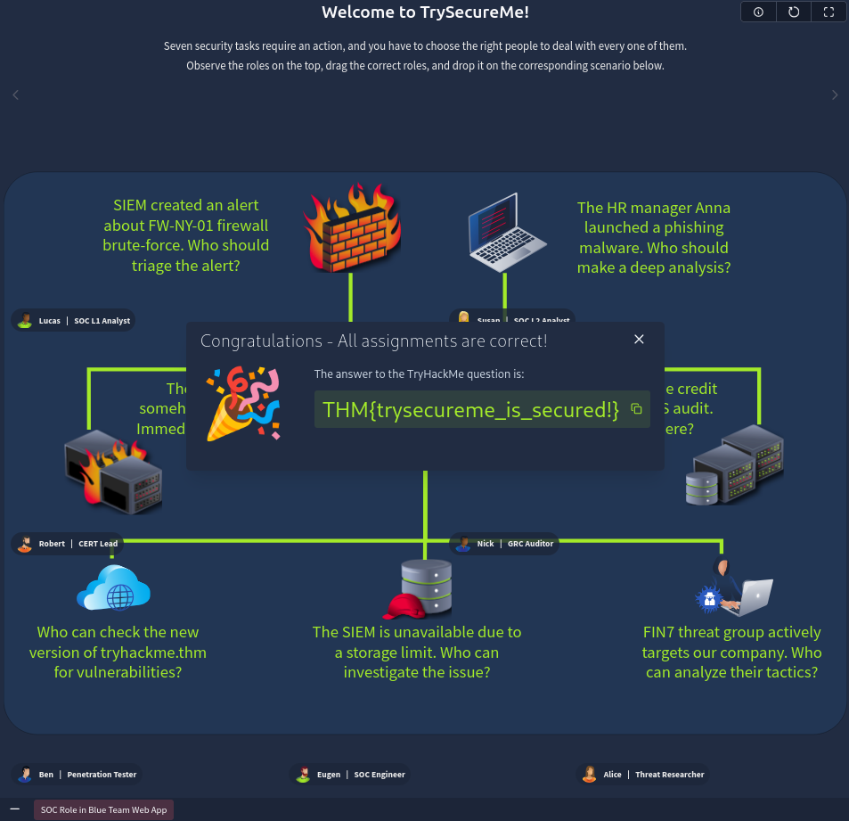

# SOC Role in Blue Team

Cybersecurity | Blue Team | SOC | CIRT | SOC Analyst

Modern organizations rely heavily on defensive security teams to detect, investigate, and respond to cyber threats before they escalate into full-scale incidents. In this room, we explore how security teams are structured inside organizations, how a SOC operates, and the career progression of a SOC Analyst. We also solve a practical challenge where we act as a CISO and assign the right teams to ongoing incidents. 🔵

---

# Task 1 — Introduction

This room focuses on understanding where a Junior Security Analyst fits inside a company’s cybersecurity hierarchy and how different teams collaborate together.

We also explore:

* Security hierarchy inside organizations
* Blue Team operations
* SOC and CIRT responsibilities
* Career progression for SOC analysts
* MSSP vs Internal SOC

No questions were required in this task.

---

# Task 2 — Security Hierarchy

Organizations structure their cybersecurity teams differently depending on business priorities.

For example:

* Hospitals prioritize patient safety
* Law firms prioritize confidentiality
* Factories prioritize operational availability

Because of this, companies build dedicated security leadership and operational teams.

## Security Structure

### Executives

Focus on overall business operations.

Examples:

* CEO
* CFO
* Company Owner

### Security Leadership

Responsible for company-wide cybersecurity strategy.

Examples:

* CTO
* CIO
* CISO

The CISO is usually the senior-most cybersecurity decision maker.

### Security Managers

Manage individual security teams and operations.

Examples:

* SOC Manager
* Team Lead

### Technical Teams

Perform hands-on security operations.

Examples:

* SOC Analysts
* Engineers
* Red Teamers

---

## Question 1

### Which senior role typically makes key cyber security decisions?

### Answer:

```text
CISO
```

---

## Question 2

### What is the common name for roles like SOC analysts and engineers?

### Answer:

```text
Blue Team
```

---

# Meet the Blue Team

The Blue Team focuses on defensive security operations. Their primary goal is to detect attacks early and respond before damage spreads.

This includes:

* Monitoring logs
* Investigating alerts
* Threat detection
* Incident response
* SIEM monitoring
* Detection engineering

---

# Security Operations Center (SOC)

The SOC acts as the first line of defense.

Main responsibilities include:

* 24/7 monitoring
* Log collection
* Alert triage
* Threat investigation
* Creating detection rules
* Reporting incidents

---

## SOC Roles

### L1 Analysts

Entry-level analysts who:

* Monitor alerts
* Perform initial triage
* Escalate suspicious activity

### L2 Analysts

More experienced analysts who:

* Handle deeper investigations
* Perform advanced threat analysis
* Investigate complex incidents

### SOC Engineers

Responsible for:

* Configuring SIEMs
* Managing EDR platforms
* Building detections
* Security tool maintenance

### SOC Manager

Handles operational oversight of the entire SOC.

---

# Cyber Incident Response Team (CIRT)

The CIRT (also called CSIRT/CERT) responds to active and critical incidents.

Unlike the SOC, which continuously monitors environments, CIRT teams are usually activated during major incidents.

Responsibilities include:

* Incident containment
* Digital forensics
* Threat hunting
* Malware analysis
* Recovery operations

---

## Question 3

### Does Blue Team focus on defensive or offensive security?

### Answer:

```text
Defensive
```

---

## Question 4

### Which department handles active or urgent cyber incidents?

### Answer:

```text
CIRT
```

---

# Advancing a SOC Career

Starting as an SOC L1 Analyst is one of the best ways to build strong cybersecurity fundamentals.

You gain experience in:

* SIEM monitoring
* Threat detection
* Log analysis
* Incident response
* Security tooling
* Investigative workflows

---

# Tips for Growth

### 1. Practice SOC Skills

Hands-on labs and real-world alert analysis help build experience.

### 2. Stay Active in Cybersecurity

CTFs, blogs, research, and certifications improve exposure.

### 3. Prepare for Interviews

Understanding how MSSPs and internal SOCs differ is important during hiring.

### 4. Progress Toward Specialized Roles

Natural progression includes:

* SOC L2
* Threat Hunting
* CIRT
* Engineering
* Security Leadership

---

# Internal SOC vs MSSP

Organizations can either:

* Build an internal SOC
* Outsource to an MSSP

## Internal SOC

An in-house security team protecting a single organization.

Advantages:

* Deep organizational knowledge
* Better context awareness
* Stable environment

## MSSP

A Managed Security Services Provider handles security monitoring for multiple clients.

Advantages:

* Exposure to many attack types
* Faster learning curve
* Large-scale operational experience

The environment is usually much faster paced due to high alert volumes.

---

## Question 5

### How would you call a cyber security company providing SOC services?

### Answer:

```text
MSSP
```

---

## Question 6

### Which role naturally continues your SOC L1 analyst journey?

### Answer:

```text
SOC L2 Analyst
```

---

# Final Challenge

In the final practical challenge, we take the role of a CISO at TrySecureMe and assign the correct cybersecurity teams to various incidents.

The challenge tests understanding of:

* SOC responsibilities
* CIRT involvement
* Security hierarchy
* Incident ownership

---

## Solving the Challenge

We drag and drop the correct cybersecurity roles onto each incident scenario.

The idea behind this challenge is understanding which teams are responsible for specific situations.

For example:

* SOC handles monitoring and alert triage
* CIRT handles active breaches
* GRC handles compliance-related concerns
* Red Team focuses on offensive simulations

Once all assignments are correct, the platform reveals the final flag.

---

## Final Flag

```text
THM{trysecureme_is_secured}
```



---

# Conclusion

This room provides a solid introduction to Blue Team operations and SOC structure.

Key takeaways:

* Understanding cybersecurity hierarchy
* Learning SOC responsibilities
* Difference between SOC and CIRT
* MSSP vs Internal SOC
* SOC career progression

For beginners aiming to enter defensive security, this room gives a strong conceptual foundation before moving into deeper incident response and detection engineering topics.

---

# Next Learning Path

Recommended rooms after this:

1. Humans as Attack Vectors
2. Systems as Attack Vectors

These rooms continue building practical defensive security knowledge.

---

# Room Completion

Successfully completed the room and understood how Blue Teams operate inside modern organizations. 🚀

---
